# First Order | Software de Lógica Simbólica & FBF (Versión Final 1.0)

[](https://developer.mozilla.org/es/docs/Web/JavaScript)
[](package.json)
[-4F46E5)](js/icons.js)
[-06B6D4)](js/ml/neuralNet.js)
[](AGENTS.md)

Aplicación web integral, modular y de alto rendimiento desarrollada para la cátedra de **Lógica Simbólica (Semestre 4 - Universidad José Antonio Páez)**. Proporciona una suite completa para construir proposiciones moleculares a partir de proposiciones atómicas y conectivos lógicos, obtener la **Fórmula Bien Formada (FBF)** correspondiente, ejecutar el **proceso inverso** determinista (de FBF a lenguaje natural), calcular tablas de verdad exhaustivas con desglose de todas las operaciones intermedias, gestionar elementos lógicos favoritos mediante popovers interactivos, administrar secciones académicas y competir en un centro de prácticas gamificado impulsado por un modelo de Machine Learning local junto a la tutoría interactiva de **Moli**, la mascota robótica OLED.

---

## Características Principales (Versión Final 1.0)

### 1. Constructor Visual de Proposiciones Moleculares (Proceso Directo)
- **Definición Dinámica de Variables Atómicas**: Permite asignar enunciados en lenguaje natural para variables proposicionales básicas ($p, q, r, s, t...$), añadir nuevas variables dinámicamente con badges visuales y limpiar textos individuales con un solo clic.
- **Generación de Atómicas Aleatorias**: Genera automáticamente proposiciones atómicas coherentes en español ajustadas al número exacto de variables activas en pantalla.
- **Ensamble Ergonómico de Tokens**: Lienzo interactivo con botones ergonómicos para insertar variables, negación ($\neg$), conjunción ($\land$), disyunción ($\lor$), condicional ($\to$), bicondicional ($\leftrightarrow$) y paréntesis balanceados.
- **Generación de Moleculares Complejas**: Produce fórmulas moleculares aleatorias estructuradas y anidadas (ej. $s \to (\neg s \land ((p \lor t) \lor (t \land s)))$), cargando los tokens en el lienzo y actualizando su traducción en tiempo real.
- **Traducción Simultánea Bidireccional**: Visualización en tiempo real tanto de la **Fórmula Bien Formada (FBF)** con paréntesis balanceados como de la **Proposición Molecular en Lenguaje Natural** en español.

### 2. Proceso Inverso Determinista (FBF a Lenguaje Natural)
- **Ingreso Flexible de Fórmulas**: Admite el ingreso mediante teclado físico o teclado virtual auxiliar en pantalla.
- **Generación de FBF Aleatoria**: Crea instantáneamente una FBF sintácticamente válida con paréntesis balanceados.
- **Analizador Léxico y Sintáctico (AST)**: Identifica, tokeniza y extrae automáticamente todas las variables atómicas presentes ($p, q, r...$).
- **Autocompletado de Enunciados**: Permite asignar enunciados aleatorios o personalizados a las variables detectadas manteniendo el principio de determinismo.
- **Reconstrucción Semántica Automática**: Ensambla y formatea la proposición molecular en español respetando la precedencia formal de los operadores lógicos.

### 3. Motor de Análisis Lógico y "Todas las Operaciones Posibles"
- **Tabla de Verdad Exhaustiva**:
  - Calcula automáticamente todas las $2^n$ combinaciones de valores de verdad.
  - Genera columnas intermedias de evaluación paso a paso para fórmulas de hasta 6 proposiciones atómicas (con advertencia didáctica de límite computacional para $n > 6$, conservando el diagnóstico formal).
  - Clasificación lógica automática: **TAUTOLOGÍA**, **CONTRADICCIÓN** o **CONTINGENCIA**.
- **Cálculo Combinatorio de "Todas las Operaciones Posibles" (`allOperations.js`)**:
  - Computa todas las combinaciones posibles de pares $C(N, 2)$ para las variables activas.
  - Evalúa y desglosa las 5 operaciones lógicas fundamentales (conjunción, disyunción, condicional directo e inverso, bicondicional).
  - Presenta tablas condensadas con clasificación lógica y traducción inmediata a lenguaje natural.
- **Árbol Sintáctico Jerárquico**:
  - Representación gráfica con ramas conectadas en CSS (`.tree`) que desglosa visualmente el conectivo principal en la raíz, los operadores secundarios y las proposiciones atómicas terminales.
- **Doble Notación Formal con Bloqueo de Administrador**:
  - **Notación Estándar**: $\neg, \land, \lor, \to, \leftrightarrow$
  - **Notación Alternativa**: $\sim, \&, \lor, \supset, \equiv$
  - El administrador puede permitir libre selección o forzar una notación obligatoria desde la pestaña de Parámetros.

### 4. Biblioteca de Elementos Guardados & Popovers Flotantes (`savedItemsStorage.js`, `savedItemsPopover.js`)
- **Persistencia Local por Usuario**: Permite guardar y recuperar elementos lógicos favoritos organizados en tres categorías:
  - **Proposiciones Atómicas** (cuota: 15 elementos).
  - **Fórmulas FBF** (cuota: 20 elementos).
  - **Proposiciones Moleculares Completas** (cuota: 15 elementos).
- **Popovers Ergonómicos Flotantes**:
  - Interfaz emergente Glassmorphism con badges coloreados por variable, textos truncados accesibles mediante tooltip y botones de inserción rápida.
  - Asignación inmediata al agregar nuevas variables sin perder el flujo de trabajo.
  - Eliminación reactiva in situ (el elemento se remueve del popover sin recargar ni cerrarlo).
- **Feedback Visual de Baja Invasión**: Efectos de flash sutiles de 1 segundo de duración aplicados únicamente al botón activador, evitando parpadeos de pantalla molestos.

### 5. Gestión de Secciones Académicas y Roles Multiusuario Offline (`sectionsStorage.js`, `storage.js`)
- **Base de Datos Local Embebida (100% Offline)**:
  - **Estudiante**: Acceso rápido con Nombre y **PIN de 3 dígitos** (ej. `123`). Acceso a prácticas, construcción, inverso y tablas de verdad con aislamiento de estadísticas y modelo neuronal.
  - **Profesor**: Acceso con Contraseña (&ge; 4 caracteres). Capacidades analíticas completas y gestión de secciones académicas para agrupar y supervisar alumnos.
  - **Administrador**: Contraseña maestra fija (`1234`). Acceso a herramientas y exclusivo a la pestaña de **Parámetros**.
- **Parámetros del Sistema en Grid Responsive de 2 por Fila**:
  - Panel administrativo reorganizado en una cuadrícula ergonómica y adaptable de 2 columnas.
  - Habilitación y bloqueo selectivo de minijuegos para estudiantes con guardado en tiempo real y banners de notificación informativos.
  - Protección de navegación segura: al cerrar sesión desde la vista de parámetros, el sistema restablece automáticamente la vista activa al Constructor Visual.

### 6. Mascota Robótica OLED ("Moli") & Tutor Contextual
- **Visor Robótico OLED (174px × 90px)**: Pantalla de contorno cápsula con ojos vectoriales SVG expresivos y luz de neón cian/esmeralda.
- **Seguimiento Dinámico del Cursor (Mouse Tracking)**: Los ojos de Moli siguen el movimiento del puntero del mouse en tiempo real durante los minijuegos de razonamiento lógico (`mousemove`), manteniéndose dentro de límites elásticos de seguridad calculados geométricamente.
- **Animación de Vuelo FLIP**: Moli se desplaza suavemente en vuelo robótico (`cubic-bezier(0.25, 1.25, 0.5, 1)`) desde su posición flotante inferior derecha para acoplarse en la ranura dedicada (`#mascot-dock-slot`) al ingresar al Centro de Prácticas o Resumen, y retorna automáticamente al salir.
- **Mensajería Reactiva en Secciones**: Analiza el avance del estudiante o profesor en la pestaña de Secciones, ofreciendo felicitaciones por tareas concluidas, explicaciones didácticas o recordatorios contextuales.
- **Diálogo Contextual con Auto-Cierre de 4 Segundos**: Al hacer clic en Moli, despliega un globo didáctico adaptado a la pantalla actual que se cierra automáticamente tras **4 segundos exactos**.
- **Máquina de Estados de Animación Ociosa (Idle State Machine)**: Pestañeos espontáneos, mirada curiosa hacia los lados, expresión escéptica con ceja alzada (*smirk* analítico) y modo siesta (*zzz*) con letras flotantes y despertar sobresaltado.

### 7. Centro de Prácticas Gamificado (4 Minijuegos con Machine Learning)
- **Minijuegos Calibrados por Dificultad (Fácil, Normal, Difícil)**:
  - **Árbol Correcto**: Identifica la FBF generada por el árbol sintáctico jerárquico entre 4 opciones. Las opciones erróneas se atenúan para permitir deducción continua.
  - **Moleculares**: Construcción guiada de la FBF a partir del enunciado en lenguaje natural mediante una paleta de tokens y bloques.
  - **Veredicto**: Deduce a contrarreloj si una fórmula es Tautología, Contradicción o Contingencia con bonificación de puntos y penalización controlada.
  - **Duelo contra Moli (IA)**: Batalla en tiempo real evaluando fórmulas bajo asignaciones atómicas dadas. La IA simula tiempo de reflexión y comete fallos controlados según la dificultad elegida.
- **Mecanismos Anti-Spam y Variabilidad de Rondas**:
  - Bloqueo inmediato al pulsar una opción para impedir duplicación de puntaje.
  - Pausa de enfriamiento (*cooldown*) visual de 900 ms entre ejercicios.
  - Buffer de historial (`lastFBFs`) que garantiza no repetir fórmulas en las 2 rondas previas.
  - Rotación obligatoria de la opción correcta (`lastCorrectOptionIndex`).
- **Motor de Machine Learning (Red Neuronal Multicapa MLP en JS Nativo)**:
  - Implementación de un Perceptrón Multicapa nativo en `js/ml/neuralNet.js` sin frameworks externos.
  - Modelado cognitivo continuo en `js/ml/studentModel.js` que registra desempeño, tasas de error y tiempos de respuesta por conectivo ($\neg, \land, \lor, \to, \leftrightarrow$).
  - Calibración adaptativa del comportamiento de Moli en modo Duelo y generación de diagnósticos pedagógicos en el resumen final.

### 8. Identidad Visual 100% Libre de Emojis
- Sustitución integral de emojis por una biblioteca técnica y uniforme de iconos vectoriales SVG limpios (`js/icons.js`).
- Modales personalizados de confirmación y advertencia en sustitución de las funciones nativas bloqueantes (`window.confirm`).

---

## Arquitectura de Seguridad, Sandboxing y Privacidad

El proyecto está diseñado bajo el principio de **Privacidad por Diseño** (*Privacy by Design*) y **Aislamiento Local Estricto**:

```
+-------------------------------------------------------------------------+
|                          NAVEGADOR CLIENTE                              |
|                                                                         |
|  +-------------------------------------------------------------------+  |
|  |                 Content Security Policy (CSP)                     |  |
|  |  - default-src 'self'                                             |  |
|  |  - connect-src 'none' (CERO llamadas de red / CERO telemetría)    |  |
|  |  - object-src 'none'  (Bloqueo de plugins/Flash/Applets)          |  |
|  |  - base-uri 'self'; form-action 'self'                            |  |
|  +-------------------------------------------------------------------+  |
|                                                                         |
|  +---------------------------+       +-------------------------------+  |
|  | Sanitización DOM          |       | Sandboxing LocalStorage       |  |
|  | - escapeHtml() preventivo |       | - Cuotas estrictas por perfil |  |
|  | - Cero eval() / Function()|       | - Aislamiento multiusuario    |  |
|  +---------------------------+       +-------------------------------+  |
+-------------------------------------------------------------------------+
                                     |
                       [SIN ACCESO AL DISPOSITIVO]
                                     x
+-------------------------------------------------------------------------+
|                  HOST / SISTEMA OPERATIVO / ARCHIVOS                    |
|  - Directorio del usuario (%USERPROFILE% / ~/.ssh / ~/.aws) PROTEGIDO   |
|  - Cero ejecución de comandos de terminal arbitrarios                   |
|  - Cero inyección de malware / Cero descarga de ejecutables             |
|  - Documentos internos de desarrollo (docs/plans/) ocultos en .gitignore|
+-------------------------------------------------------------------------+
```

1. **Cero Conexiones Salientes & Cero Telemetría (`connect-src 'none'`)**: La aplicación funciona en un entorno estanco sin enviar ni recibir datos de servidores externos.
2. **Protección contra Malware e Inyección de Código**:
   - Se prohíbe el uso de `eval()` y constructores de funciones dinámicas en la evaluación lógica.
   - Todo dato ingresado por el usuario se escapa antes de renderizarse en el DOM.
3. **Guardrails de Ejecución para Agentes y Desarrolladores (`AGENTS.md`)**:
   - Prohibición estricta de acceso a archivos del sistema fuera del repositorio.
   - Prohibición de ejecución de scripts o binarios no autorizados.
4. **Protección de Archivos Sensibles**:
   - Los planes y especificaciones internas de desarrollo (`docs/plans/`) están estrictamente ignorados en `.gitignore` y desvinculados del árbol de control de versiones.

---

## Estructura de Software

```
proposiciones moleculares/
├── index.html                   # Interfaz semántica principal, modales y visor de Moli
├── README.md                    # Documentación técnica completa del proyecto
├── AGENTS.md                    # Guardrails de seguridad, sandboxing y políticas del agente
├── package.json                 # Configuración del paquete y script de pruebas nativo
├── favicon.svg                  # Icono de la aplicación
├── .gitignore                   # Exclusión de dependencias, temporales y planes internos
├── css/
│   ├── style.css                # Estilos globales, diseño del sistema, popovers y árbol (.tree)
│   └── practice-mascot.css      # Estilos del Centro de Prácticas, animaciones OLED y Moli
├── js/
│   ├── app.js                   # Controlador principal, navegación segura y coordinación
│   ├── icons.js                 # Biblioteca de iconos vectoriales SVG (política Cero Emojis)
│   ├── storage.js               # Persistencia de usuarios, sesiones y configuraciones
│   ├── savedItemsStorage.js     # Persistencia local y cuotas de elementos guardados
│   ├── savedItemsPopover.js     # Componente visual flotante de elementos lógicos favoritos
│   ├── sectionsStorage.js       # Gestión de secciones académicas y asignación de alumnos
│   ├── feedbackEffects.js       # Efectos de retroalimentación visual y microinteracciones
│   ├── logic/
│   │   ├── allOperations.js     # Motor de cálculo exhaustivo de todas las operaciones posibles
│   │   ├── ast.js               # Tokenizador formal, parser recursivo y árbol sintáctico (AST)
│   │   ├── generators.js        # Generadores deterministas de fórmulas y proposiciones atómicas
│   │   ├── naturalLanguage.js   # Traductor determinista AST <-> lenguaje natural en español
│   │   └── truthTable.js        # Motor evaluador de tablas de verdad y clasificador formal
│   ├── mascot/
│   │   ├── mascotController.js  # Coordinador pedagógico, estados ociosos y reactividad de Moli
│   │   └── mascotView.js        # Renderizado SVG del visor OLED, seguimiento ocular y vuelo FLIP
│   ├── ml/
│   │   ├── neuralNet.js         # Red Neuronal Artificial (Perceptrón Multicapa) en JS nativo
│   │   └── studentModel.js      # Extractor de métricas cognitivas y diagnósticos pedagógicos
│   └── practice/
│       ├── practiceEngine.js    # Motor de los 4 minijuegos, cooldowns, anti-spam y rotaciones
│       └── practiceView.js      # Renderizado de arenas de juego, lobby, duelos y resumen
├── tests/
│   ├── allOperations.test.js    # Pruebas del motor combinatorio de todas las operaciones
│   ├── authState.test.js        # Pruebas de validación de formularios y roles
│   ├── gameAvailability.test.js# Pruebas de configuración y bloqueo de minijuegos por Admin
│   ├── mascotReactivity.test.js # Pruebas de mensajes reactivos y felicitaciones de Moli
│   ├── mascotTracking.test.js   # Pruebas de seguimiento ocular del visor OLED
│   ├── savedItems.test.js       # Pruebas de persistencia, cuotas y popovers de elementos
│   ├── savedItemsIntegration.test.js # Pruebas de integración visual y feedback flash
│   ├── sectionsAuth.test.js     # Pruebas de secciones académicas y cascada de borrado
│   └── zeroEmojis.test.js       # Verificación estricta de la política Cero Emojis
└── docs/
    ├── SPEC_ADMIN_JUEGOS_Y_MOLI_INTERACTIVO.md
    ├── SPEC_AUTH_LOCAL_DB.md
    ├── SPEC_DISENO_FULLWIDTH_DOCK_MINIMAL.md
    ├── SPEC_DISENO_NEOPOP_DUOLINGO.md
    ├── SPEC_PERSISTENCIA_ELEMENTOS_LOGICOS.md
    ├── SPEC_PRACTICAS_Y_ML.md
    ├── SPEC_SECCIONES_Y_ADMIN.md
    └── SPEC_TODAS_LAS_OPERACIONES.md
```

---

## Diagrama de Flujo del Sistema (Workflows & Architecture)

```mermaid
%% Generated by https://gitdiagram.com/itsluuis/first-order-logic
flowchart TD

subgraph group_app["Application workflows"]
  node_controller["App controller<br/>[app.js]"]
  node_builder["Visual builder<br/>[app.js]"]
  node_inverse["Inverse workflow<br/>[app.js]"]
end

subgraph group_logic["Logic tools"]
  node_parser["FBF parser and AST<br/>[ast.js]"]
  node_generators["Random generators<br/>[generators.js]"]
  node_language["Natural-language mapping<br/>[naturalLanguage.js]"]
  node_truth["Truth-table engine<br/>[truthTable.js]"]
end

subgraph group_practice["Practice and learning"]
  node_practice_view["Practice interface<br/>[practiceView.js]"]
  node_practice_engine["Four-game engine<br/>[practiceEngine.js]"]
  node_student_model["Student learning model<br/>[studentModel.js]"]
  node_neural_net["Neural network<br/>[neuralNet.js]"]
end

subgraph group_moli["Moli tutor"]
  node_mascot_controller["Moli controller"]
  node_mascot_view["Moli OLED view<br/>[mascotView.js]"]
end

subgraph group_state["Local state"]
  node_profiles[("Profiles and settings<br/>[storage.js]")]
end

node_student(("Student"))

node_student -->|"uses app"| node_controller
node_controller -->|"reads and writes"| node_profiles
node_controller -->|"routes to"| node_builder
node_controller -->|"routes to"| node_inverse
node_controller -->|"requests evaluation"| node_truth
node_controller -->|"initializes"| node_practice_view
node_controller -->|"initializes"| node_practice_engine
node_controller -->|"initializes"| node_mascot_controller
node_builder -->|"generates formulas"| node_generators
node_builder -->|"translates proposition"| node_language
node_builder -->|"formats FBF"| node_parser
node_inverse -->|"parses FBF"| node_parser
node_inverse -->|"generates FBF"| node_generators
node_inverse -->|"reconstructs proposition"| node_language
node_truth -->|"reads AST"| node_parser
node_practice_engine -->|"parses and formats"| node_parser
node_practice_engine -->|"evaluates formulas"| node_truth
node_practice_engine -.->|"reports performance"| node_student_model
node_student_model -->|"trains and predicts"| node_neural_net
node_student_model -->|"persists profile"| node_profiles
node_mascot_controller -->|"updates display"| node_mascot_view
node_mascot_controller -->|"requests diagnosis"| node_student_model
node_mascot_controller -->|"reads app context"| node_controller
node_student -->|"plays games"| node_practice_view

click node_controller "https://github.com/itsluuis/first-order-logic/blob/main/js/app.js"
click node_profiles "https://github.com/itsluuis/first-order-logic/blob/main/js/storage.js"
click node_builder "https://github.com/itsluuis/first-order-logic/blob/main/js/app.js"
click node_inverse "https://github.com/itsluuis/first-order-logic/blob/main/js/app.js"
click node_parser "https://github.com/itsluuis/first-order-logic/blob/main/js/logic/ast.js"
click node_generators "https://github.com/itsluuis/first-order-logic/blob/main/js/logic/generators.js"
click node_language "https://github.com/itsluuis/first-order-logic/blob/main/js/logic/naturalLanguage.js"
click node_truth "https://github.com/itsluuis/first-order-logic/blob/main/js/logic/truthTable.js"
click node_practice_view "https://github.com/itsluuis/first-order-logic/blob/main/js/practice/practiceView.js"
click node_practice_engine "https://github.com/itsluuis/first-order-logic/blob/main/js/practice/practiceEngine.js"
click node_student_model "https://github.com/itsluuis/first-order-logic/blob/main/js/ml/studentModel.js"
click node_neural_net "https://github.com/itsluuis/first-order-logic/blob/main/js/ml/neuralNet.js"
click node_mascot_controller "https://github.com/itsluuis/first-order-logic/blob/main/js/mascot/mascotController.js"
click node_mascot_view "https://github.com/itsluuis/first-order-logic/blob/main/js/mascot/mascotView.js"

classDef toneNeutral fill:#f8fafc,stroke:#334155,stroke-width:1.5px,color:#0f172a
classDef toneBlue fill:#dbeafe,stroke:#2563eb,stroke-width:1.5px,color:#172554
classDef toneAmber fill:#fef3c7,stroke:#d97706,stroke-width:1.5px,color:#78350f
classDef toneMint fill:#dcfce7,stroke:#16a34a,stroke-width:1.5px,color:#14532d
classDef toneRose fill:#ffe4e6,stroke:#e11d48,stroke-width:1.5px,color:#881337
classDef toneIndigo fill:#e0e7ff,stroke:#4f46e5,stroke-width:1.5px,color:#312e81
classDef toneTeal fill:#ccfbf1,stroke:#0f766e,stroke-width:1.5px,color:#134e4a
class node_controller,node_builder,node_inverse toneBlue
class node_parser,node_generators,node_language,node_truth toneAmber
class node_practice_view,node_practice_engine,node_student_model,node_neural_net toneMint
class node_mascot_controller,node_mascot_view toneRose
class node_profiles,node_student toneIndigo
```



---

## Pila Tecnológica (Tech Stack)

- **Núcleo de Lenguaje**: JavaScript Vanilla (ES6+ Modules, programación orientada a objetos y funcional sin transpiladores).
- **Estructura y Maquetación**: HTML5 semántico con directivas de accesibilidad, atributos `aria-*` y etiquetas meta de seguridad CSP.
- **Estilos y Diseño Visual**: CSS3 nativo con variables personalizadas, Glassmorphism, efectos de brillo ambiental, flexbox, CSS Grid y animaciones de vuelo FLIP.
- **Inteligencia Artificial y Machine Learning**: Red Neuronal Artificial local (Perceptrón Multicapa) con propagación hacia adelante (*feedforward*), cálculo de error cuadrático medio y ajuste de pesos sin dependencias de red.
- **Iconografía Técnica**: Catálogo vectorial SVG inline y reutilizable (`js/icons.js`).
- **Almacenamiento Local**: `Window.localStorage` con serialización JSON sanitizada, gestión de perfiles y cuotas estrictas de almacenamiento.
- **Suite de Pruebas**: Node.js Test Runner nativo (`node --test`), con 59 especificaciones automatizadas.

---

## Instrucciones de Instalación y Ejecución

### Opción 1: Ejecución Directa en el Navegador (Sin dependencias)
Dado que la aplicación está construida con tecnologías web estándar y funciona de manera 100% local:
1. Clona el repositorio o descarga el código fuente:
   ```bash
   git clone https://github.com/itsluuis/First-order-logic.git
   cd First-order-logic
   ```
2. Abre directamente el archivo `index.html` con cualquier navegador web moderno (Google Chrome, Mozilla Firefox, Microsoft Edge, Safari, Brave, Opera).

### Opción 2: Servidor Local de Desarrollo
Para una experiencia óptima con módulos ES6 y caché de navegador:
```bash
# Con Node.js (npx)
npx serve .

# O con Python 3
python -m http.server 8080
```
Luego accede a `http://localhost:8080` en tu navegador.

### Opción 3: Ejecución de la Suite de Pruebas Automatizadas
El proyecto incluye 59 pruebas que validan motores lógicos, autenticación, cuotas de guardado, animaciones y políticas de seguridad:
```bash
npm test
```

---

## Credenciales y Roles de Acceso

| Perfil | Credencial de Acceso | Privilegios y Herramientas |
| :--- | :--- | :--- |
| **Estudiante** | Nombre de usuario + **PIN de 3 dígitos** (ej. `123`) | Constructor visual, proceso inverso, tablas de verdad, minijuegos y duelos contra Moli con aislamiento total de estadísticas y progreso. |
| **Profesor** | Nombre de usuario + **Contraseña** (&ge; 4 caracteres) | Acceso pedagógico completo, consulta analítica y gestión de secciones de clase para asignación y seguimiento de alumnos. |
| **Administrador** | Contraseña maestra fija (`1234`) | Acceso exclusivo a la pestaña de **Parámetros** en grid de 2 por fila para fijar notación lógica obligatoria y bloquear o habilitar minijuegos. |

---

## Autoría y Créditos

- **Desarrollador Principal**: **Luis Carlos** ([@itsluuis](https://github.com/itsluuis))
- **Institución**: Cátedra de Lógica Simbólica - **Universidad José Antonio Páez** (Semestre 4).
- **Licencia**: Proyecto académico de código abierto bajo licencia MIT.
