```mermaid
%% Generated by https://gitdiagram.com/itsluuis/first-order-logic
flowchart TD

subgraph group_app["Application workflows"]
  node_controller["App controller<br/>[app.js]"]
  node_builder["Visual builder<br/>[app.js]"]
  node_inverse["Inverse workflow<br/>[app.js]"]
end

subgraph group_logic["Logic tools"]
  node_parser["FBF parser and AST<br/>[ast.js]"]
  node_generators["Random generators<br/>[generators.js]"]
  node_language["Natural-language mapping<br/>[naturalLanguage.js]"]
  node_truth["Truth-table engine<br/>[truthTable.js]"]
end

subgraph group_practice["Practice and learning"]
  node_practice_view["Practice interface<br/>[practiceView.js]"]
  node_practice_engine["Four-game engine<br/>[practiceEngine.js]"]
  node_student_model["Student learning model<br/>[studentModel.js]"]
  node_neural_net["Neural network<br/>[neuralNet.js]"]
end

subgraph group_moli["Moli tutor"]
  node_mascot_controller["Moli controller"]
  node_mascot_view["Moli OLED view<br/>[mascotView.js]"]
end

subgraph group_state["Local state"]
  node_profiles[("Profiles and settings<br/>[storage.js]")]
end

node_student(("Student"))

node_student -->|"uses app"| node_controller
node_controller -->|"reads and writes"| node_profiles
node_controller -->|"routes to"| node_builder
node_controller -->|"routes to"| node_inverse
node_controller -->|"requests evaluation"| node_truth
node_controller -->|"initializes"| node_practice_view
node_controller -->|"initializes"| node_practice_engine
node_controller -->|"initializes"| node_mascot_controller
node_builder -->|"generates formulas"| node_generators
node_builder -->|"translates proposition"| node_language
node_builder -->|"formats FBF"| node_parser
node_inverse -->|"parses FBF"| node_parser
node_inverse -->|"generates FBF"| node_generators
node_inverse -->|"reconstructs proposition"| node_language
node_truth -->|"reads AST"| node_parser
node_practice_engine -->|"parses and formats"| node_parser
node_practice_engine -->|"evaluates formulas"| node_truth
node_practice_engine -.->|"reports performance"| node_student_model
node_student_model -->|"trains and predicts"| node_neural_net
node_student_model -->|"persists profile"| node_profiles
node_mascot_controller -->|"updates display"| node_mascot_view
node_mascot_controller -->|"requests diagnosis"| node_student_model
node_mascot_controller -->|"reads app context"| node_controller
node_student -->|"plays games"| node_practice_view

click node_controller "https://github.com/itsluuis/first-order-logic/blob/main/js/app.js"
click node_profiles "https://github.com/itsluuis/first-order-logic/blob/main/js/storage.js"
click node_builder "https://github.com/itsluuis/first-order-logic/blob/main/js/app.js"
click node_inverse "https://github.com/itsluuis/first-order-logic/blob/main/js/app.js"
click node_parser "https://github.com/itsluuis/first-order-logic/blob/main/js/logic/ast.js"
click node_generators "https://github.com/itsluuis/first-order-logic/blob/main/js/logic/generators.js"
click node_language "https://github.com/itsluuis/first-order-logic/blob/main/js/logic/naturalLanguage.js"
click node_truth "https://github.com/itsluuis/first-order-logic/blob/main/js/logic/truthTable.js"
click node_practice_view "https://github.com/itsluuis/first-order-logic/blob/main/js/practice/practiceView.js"
click node_practice_engine "https://github.com/itsluuis/first-order-logic/blob/main/js/practice/practiceEngine.js"
click node_student_model "https://github.com/itsluuis/first-order-logic/blob/main/js/ml/studentModel.js"
click node_neural_net "https://github.com/itsluuis/first-order-logic/blob/main/js/ml/neuralNet.js"
click node_mascot_controller "https://github.com/itsluuis/first-order-logic/blob/main/js/mascot/mascotController.js"
click node_mascot_view "https://github.com/itsluuis/first-order-logic/blob/main/js/mascot/mascotView.js"

classDef toneNeutral fill:#f8fafc,stroke:#334155,stroke-width:1.5px,color:#0f172a
classDef toneBlue fill:#dbeafe,stroke:#2563eb,stroke-width:1.5px,color:#172554
classDef toneAmber fill:#fef3c7,stroke:#d97706,stroke-width:1.5px,color:#78350f
classDef toneMint fill:#dcfce7,stroke:#16a34a,stroke-width:1.5px,color:#14532d
classDef toneRose fill:#ffe4e6,stroke:#e11d48,stroke-width:1.5px,color:#881337
classDef toneIndigo fill:#e0e7ff,stroke:#4f46e5,stroke-width:1.5px,color:#312e81
classDef toneTeal fill:#ccfbf1,stroke:#0f766e,stroke-width:1.5px,color:#134e4a
class node_controller,node_builder,node_inverse toneBlue
class node_parser,node_generators,node_language,node_truth toneAmber
class node_practice_view,node_practice_engine,node_student_model,node_neural_net toneMint
class node_mascot_controller,node_mascot_view toneRose
class node_profiles,node_student toneIndigo
```

# Software de Lógica Simbólica: Proposiciones Moleculares & FBF

Aplicación web interactiva desarrollada para la cátedra de **Lógica Simbólica (Semestre 4 - Universidad José Antonio Páez)**. Permite construir proposiciones moleculares a partir de proposiciones atómicas y conectivos lógicos, obtener la **Fórmula Bien Formada (FBF)** correspondiente, realizar el **proceso inverso** determinista (de FBF a lenguaje natural), generar expresiones y proposiciones aleatorias de forma integrada, evaluar tablas de verdad completas, competir en un centro de prácticas gamificado con motor de Machine Learning local y contar con la tutoría de **Moli**, la mascota robótica OLED.

---

## Características Principales

### 1. Perfiles de Acceso Simplificados y Seguros
El sistema cuenta con 3 perfiles dedicados para evitar confusiones y garantizar la seguridad:
- **Estudiante**: Acceso directo para práctica, construcción visual, proceso inverso, tablas de verdad y centro de desafíos.
- **Profesor**: Acceso pedagógico completo con todas las herramientas analíticas.
- **Administrador**: Requiere contraseña (`1234`). Posee acceso exclusivo a la pestaña de **Parámetros** para configurar políticas globales de la plataforma (ej. forzar una notación obligatoria).
- **Protección de Navegación**: Al cerrar sesión desde la pestaña de parámetros, el sistema restablece automáticamente la vista activa al **Constructor Visual**, impidiendo accesos indebidos de perfiles no autorizados.

### 2. Constructor Visual de Proposiciones Moleculares (Proceso Directo)
- **Definición de Proposiciones Atómicas**: Asigna enunciados en lenguaje natural para variables básicas ($p, q, r, s, t...$) y añade nuevas variables dinámicamente con limpieza rápida individual.
- **Atómicas Aleatorias**: Genera enunciados coherentes en español considerando el número exacto de variables activas en pantalla.
- **Ensamble Visual Interactivo**: Lienzo de tokens con botones ergonómicos para insertar variables, negación ($\neg$), conjunción ($\land$), disyunción ($\lor$), condicional ($\to$), bicondicional ($\leftrightarrow$) y paréntesis.
- **Molecular Aleatoria**: Genera automáticamente proposiciones moleculares aleatorias complejas y anidadas (ej. $p \land (\neg s \to t)$ o $s \to (\neg s \land ((p \lor t) \lor (t \land s)))$), cargando los tokens en el lienzo y actualizando la traducción al instante.
- **Limpieza Rápida**: Botón para limpiar todo el lienzo de la proposición de un solo clic, además de botones individuales para vaciar el texto de cualquier proposición atómica rápidamente.
- **Visualización Simultánea**: Genera en tiempo real tanto la **Fórmula Bien Formada (FBF)** con paréntesis balanceados como la **Proposición Molecular en Lenguaje Natural** en español.

### 3. Proceso Inverso Determinista (FBF a Proposiciones Moleculares)
- Admite el ingreso o pegado de cualquier FBF mediante teclado físico o virtual auxiliar.
- **Generar FBF Aleatoria**: Crea de inmediato una FBF sintácticamente válida con paréntesis balanceados y la analiza en pantalla.
- **Analizador Léxico y Sintáctico (AST)**: Identifica y extrae las variables atómicas presentes ($p, q, r...$).
- **Generar Atómicas Aleatorias**: Permite autocompletar enunciados para las variables detectadas con un solo clic, o bien escribirlos manualmente para mantener el principio de determinismo y predictibilidad.
- **Reconstrucción Automática**: Ensambla y formatea la proposición molecular en español respetando la precedencia formal de operadores.

### 4. Herramientas Pedagógicas de Análisis Lógico
- **Tabla de Verdad Exhaustiva**:
  - Calcula automáticamente todas las $2^n$ combinaciones de verdad.
  - Muestra columnas intermedias de evaluación paso a paso para fórmulas de hasta 6 proposiciones atómicas. Cuando se operan más de 6 proposiciones, la tabla visual se sustituye por un aviso pedagógico indicando este límite, manteniendo siempre visible el cálculo del diagnóstico formal.
  - Diagnóstico formal automático: **TAUTOLOGÍA**, **CONTRADICCIÓN** o **CONTINGENCIA**.
- **Árbol Sintáctico Jerárquico**:
  - Representación gráfica con ramas conectadas en CSS (`.tree`) que desglosa el conectivo principal en la raíz, los operadores secundarios y las proposiciones atómicas terminales.
- **Doble Notación Lógica con Bloqueo de Administrador**:
  - **Notación Estándar**: $\neg, \land, \lor, \to, \leftrightarrow$
  - **Notación Alternativa**: $\sim, \&, \lor, \supset, \equiv$
  - El administrador puede permitir libre elección o forzar una notación obligatoria desde la pestaña de Parámetros.

### 5. Centro de Prácticas Global (Gamificación con 4 Minijuegos)
Pestaña interactiva con menú de tarjetas Bento/Glassmorphism con efectos de hover/zoom, selector de dificultades (Fácil, Normal, Difícil) y temporizador en tiempo real:
- **Árbol Correcto:** Identifica la FBF generada por el árbol sintáctico jerárquico entre 4 opciones. Si fallas, la opción errónea se atenúa para permitir seguir deduciendo hasta acertar o expirar el tiempo. Tiempos: Fácil (2:00 min), Normal (1:30 min), Difícil (0:30 min).
- **Moleculares:** Lee enunciados en lenguaje natural y construye la FBF utilizando una paleta interactiva de bloques y tokens. Tiempos: Fácil (5:00 min), Normal (2:30 min), Difícil (1:30 min).
- **Veredicto:** Deduce a toda velocidad si la fórmula es Tautología, Contradicción o Contingencia. Acierto: +1 punto. Fallo: -1 punto (tope inferior en 0) y salta de inmediato a la siguiente. Tiempos: Fácil (2:00 min), Normal (1:30 min), Difícil (0:45 min).
- **Duelo contra Moli (IA):** Compite contra Moli evaluando si una fórmula es Verdadera o Falsa bajo asignaciones atómicas dadas. La IA evalúa la fórmula en tiempo real, simula tiempo de reflexión y comete fallos controlados según la dificultad elegida. Tiempos: Fácil (2:00 min), Normal (1:30 min), Difícil (1:00 min).
- **Mecanismos Anti-Spam y Variabilidad de Rondas:**
  - Bloqueo inmediato al seleccionar respuesta para evitar sumas duplicadas de puntos.
  - Pausa de cooldown visual (900 ms) entre ejercicios para diferenciar claramente cada ronda.
  - Buffer de historial (`lastFBFs`) que garantiza no repetir fórmulas de las 2 rondas previas.
  - Rotación obligatoria (`lastCorrectOptionIndex`): la opción correcta nunca se ubica en la misma posición de la ronda anterior.
- **Pantalla de Resumen Final:** Desglose detallado de puntuación, precisión porcentual, comparativa contra la IA en Duelo y diagnósticos emitidos por la Red Neuronal.

### 6. Mascota Robótica OLED ("Moli") & Tutor Inteligente
- **Visor Robótico OLED (174px × 90px):** Diseño tipo pantalla/cápsula con ojos vectoriales SVG expresivos y luz de neón cian/esmeralda.
- **Desplazamiento Fluido en Pantalla (Animación FLIP):** Al acceder al Centro de Prácticas o a la Pantalla de Resumen, Moli se desplaza suavemente en vuelo robótico (`cubic-bezier(0.25, 1.25, 0.5, 1)`) desde la esquina inferior derecha para acoplarse en la ranura dedicada (`#mascot-dock-slot`). Al salir o iniciar una partida, vuela de vuelta a su posición flotante.
- **Máquina de Estados de Animaciones Ociosas (Idle State Machine):**
  - **Pestañeo Natural:** Parpadeos simples y dobles espontáneos.
  - **Mirada Curiosa (Vacilando):** Desplaza sus ojos a la izquierda, sostiene la mirada, la pasa a la derecha y regresa al centro.
  - **Cara Escéptica / Inquisitiva:** Expresión asimétrica inspirada en el diseño de referencia (ojo izquierdo entrecerrado con ceja descendente y ojo derecho atento con ceja oblicua alzada en *smirk* analítico con leve inclinación del visor).
  - **Modo Siesta ("zzz") y Despertar:** Ojos adormilados con letras luminosas `z z Z` flotantes que ascienden, culminando en un despertar sobresaltado (ojos abiertos de par en par con brinco elástico) antes de retomar el reposo alerta.
- **Tutor Contextual con Auto-cierre de 4 Segundos:** Al hacer clic sobre Moli en cualquier pantalla, despliega un globo de diálogo que analiza didácticamente el contexto actual. El globo se auto-cierra con precisión tras **4 segundos exactos** y se posiciona inteligentemente sobre Moli tanto en modo flotante como cuando está acoplado.

### 7. Motor de Machine Learning (Red Neuronal Perceptrón Multicapa)
- **Implementación Local Nativa (`ml/neuralNet.js`):** Red Neuronal Multicapa (MLP) construida enteramente en JavaScript moderno vanilla, sin librerías externas ni dependencias de red.
- **Modelado Cognitivo del Estudiante (`ml/studentModel.js`):**
  - Evalúa y registra el desempeño del estudiante por conectivo lógico individual ($\neg, \land, \lor, \to, \leftrightarrow$).
  - Calcula tiempos de respuesta y tasas de error.
  - Calibra dinámicamente la velocidad y comportamiento de Moli en el modo Duelo.
  - Emite sugerencias y diagnósticos pedagógicos personalizados en el Lobby y en el Resumen final.

### 8. Diseño e Identidad Visual 100% Libre de Emojis
- Se sustituyeron todos los emojis por un catálogo integral de iconos vectoriales SVG limpios, técnicos y modernos (`js/icons.js`).
- Estética Glassmorphism refinada, tipografía técnica, transiciones suaves y microinteracciones de nivel profesional.

---

## Arquitectura de Software

```
proposiciones moleculares/
├── index.html                   # Interfaz semántica principal y modales
├── README.md                    # Documentación general del proyecto
├── css/
│   ├── style.css                # Estilos globales, diseño del sistema y árbol sintáctico (.tree)
│   └── practice-mascot.css      # Estilos del Centro de Prácticas, animaciones OLED y Moli
├── js/
│   ├── app.js                   # Controlador principal, navegación segura y coordinación
│   ├── icons.js                 # Biblioteca de iconos vectoriales SVG
│   ├── storage.js               # Capa de persistencia local, base de datos de usuarios y perfiles
│   ├── logic/
│   │   ├── ast.js               # Tokenizador, parser formal y árbol sintáctico (AST)
│   │   ├── generators.js        # Generadores deterministas de fórmulas y atómicas
│   │   ├── naturalLanguage.js   # Traductor determinista AST <-> lenguaje natural
│   │   └── truthTable.js        # Motor evaluador de tablas de verdad y clasificador
│   ├── mascot/
│   │   ├── mascotController.js  # Coordinador pedagógico y estados de Moli
│   │   └── mascotView.js        # Renderizado SVG del visor OLED, vuelo FLIP y animaciones
│   ├── ml/
│   │   ├── neuralNet.js         # Red Neuronal Artificial (MLP) en JS nativo
│   │   └── studentModel.js      # Extractor de métricas y generador de recomendaciones
│   └── practice/
│       ├── practiceEngine.js    # Motor lógico de los 4 minijuegos, cooldowns y anti-spam
│       └── practiceView.js      # Renderizado de arenas de juego, lobby y resumen
└── docs/
    ├── SPEC_AUTH_LOCAL_DB.md    # Especificación de base de datos local y login offline
    └── SPEC_PRACTICAS_Y_ML.md   # Especificación técnica detallada del sistema
```

### Diagrama de Flujo del Sistema (Workflows & Architecture)



---

## Instrucciones de Uso y Ejecución

### Opción 1: Ejecución Directa en el Navegador
Abre directamente el archivo `index.html` en cualquier navegador web moderno (Google Chrome, Mozilla Firefox, Microsoft Edge, Safari, Brave).

### Opción 2: Servidor Local
Para una experiencia óptima con módulos ES6:
```bash
# Con Python
python -m http.server 8080

# O con Node.js (npx)
npx serve .
```
Luego navega a `http://localhost:8080` en tu explorador.

---

## Credenciales y Autenticación Multiusuario Local (Offline)

El sistema cuenta con una base de datos local embebida en el navegador (100% funcional sin conexión a internet) para registro e inicio de sesión:

| Perfil | Autenticación | Privilegios y Características |
| :--- | :--- | :--- |
| **Estudiante** | Nombre + **PIN de 3 dígitos** (ej. `123`) | Constructor visual, proceso inverso, tablas de verdad, centro de prácticas y duelos contra Moli con aislamiento estricto de estadísticas y modelo neuronal de IA. |
| **Profesor** | Nombre + **Contraseña** (&ge; 4 caracteres) | Todas las herramientas pedagógicas y analíticas del estudiante, preparado para gestionar secciones futuras. |
| **Administrador** | Contraseña fija (`1234`) | Acceso a herramientas lógicas y exclusivo a la pestaña de **Parámetros** para fijar políticas globales de notación. |

---

## Autor

- **Luis Carlos** ([@itsluuis](https://github.com/itsluuis))
- Cátedra de Lógica Simbólica - Universidad José Antonio Páez
